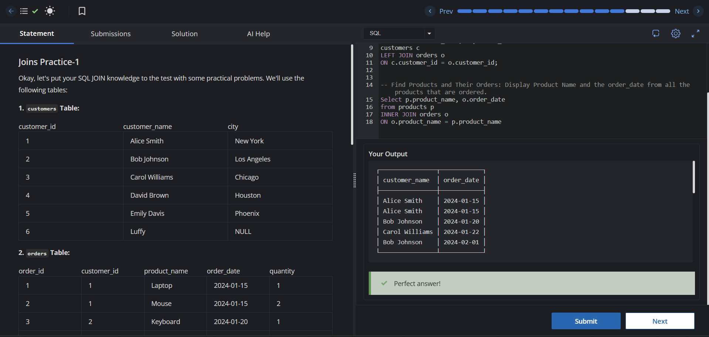
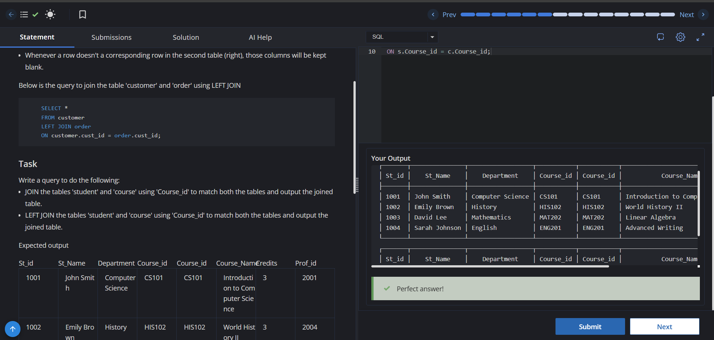
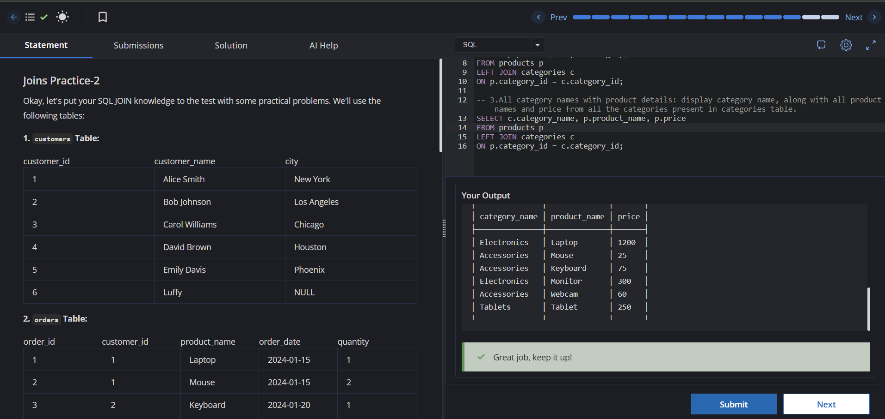
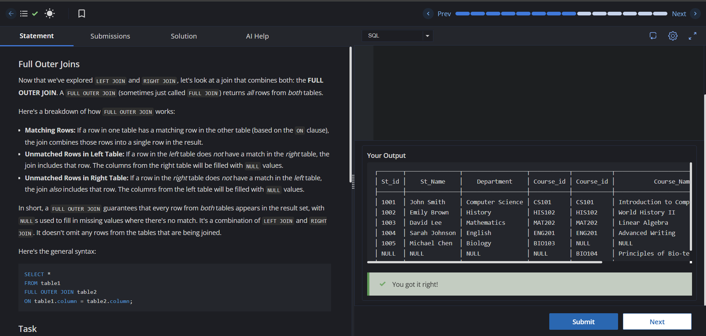
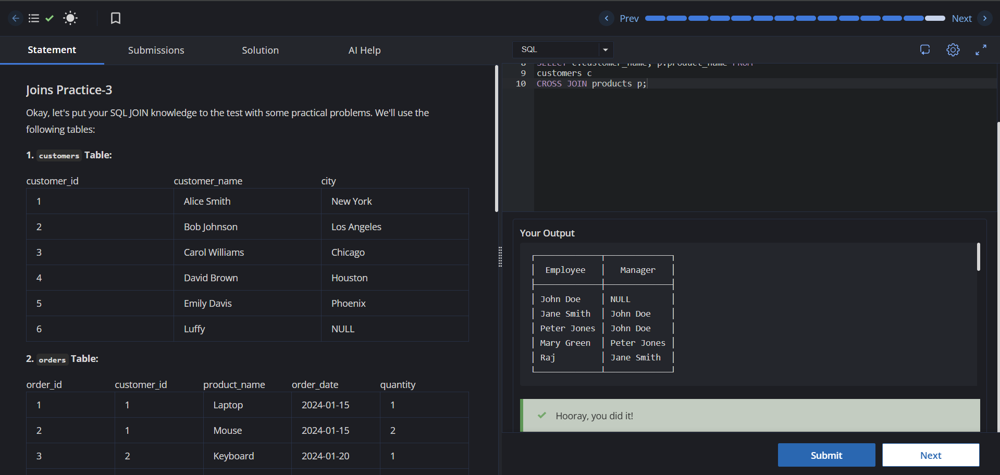
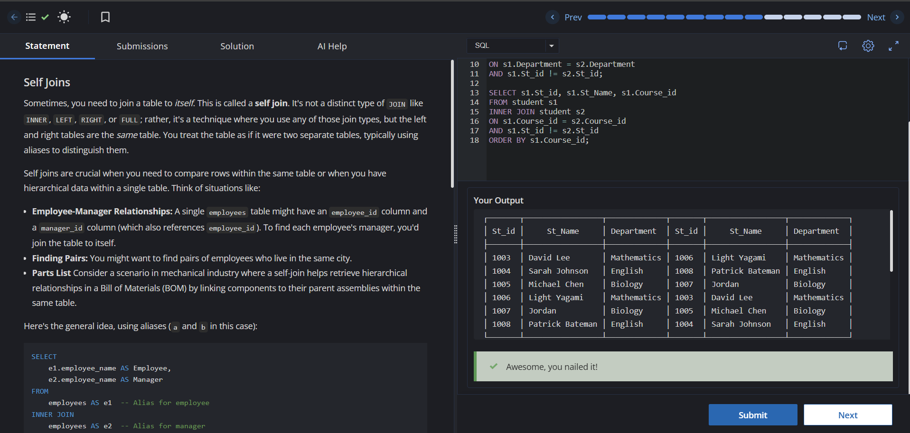

# SQL Intermediate - Experiment 4: SQL Joins


---

## 📌 Overview

This repository contains the solutions for **Experiment 4** of the **CodeChef SQL Intermediate** course.

The experiment focuses on mastering **SQL JOIN operations**, which are used to retrieve and combine data from multiple related tables. The solutions cover different join types and demonstrate their practical applications using real-world database scenarios.

---

## 🎯 Objectives

- Understand the concept of SQL JOINs.
- Learn when to use different JOIN operations.
- Retrieve meaningful information from multiple tables.
- Improve query writing and database problem-solving skills.

---

## 📚 Topics Covered

- INNER JOIN
- LEFT JOIN
- FULL OUTER JOIN
- CROSS JOIN
- SELF JOIN
- Multiple Table JOINs
- Table Aliases

---

## 📝 Problems Solved

| Experiment | Description |
|------------|-------------|
| 4.1 | Basic INNER JOIN Queries |
| 4.2 | Student and Course Joins |
| 4.3 | Multiple Table JOIN Operations |
| 4.4 | FULL OUTER JOIN Queries |
| 4.5 | CROSS JOIN & SELF JOIN |
| 4.6 | Advanced SELF JOIN Problems |

---

## 📂 Repository Structure

```
EXP4/
│── README.md
│── Exp4.txt
│── 4.1.png
│── 4.2.png
│── 4.3.png
│── 4.4.png
│── 4.5.png
└── 4.6.png
```

---

## 🛠 Technologies Used

- SQL
- Relational Databases
- CodeChef SQL Intermediate Course

---

## 📖 JOIN Types Used

| JOIN Type | Description |
|-----------|-------------|
| INNER JOIN | Returns matching records from both tables. |
| LEFT JOIN | Returns all records from the left table and matching records from the right table. |
| FULL OUTER JOIN | Returns matching and non-matching records from both tables. |
| CROSS JOIN | Produces the Cartesian product of two tables. |
| SELF JOIN | Joins a table with itself for hierarchical or related data. |

---

## 🎓 Learning Outcomes

After completing this experiment, I gained experience in:

- Writing efficient SQL JOIN queries.
- Combining data from multiple related tables.
- Understanding relationships in relational databases.
- Applying JOIN operations to solve practical database problems.

---

# 📸 Output Screenshots

## Experiment 4.1



---

## Experiment 4.2



---

## Experiment 4.3



---

## Experiment 4.4



---

## Experiment 4.5



---

## Experiment 4.6



---

## 📚 Reference

These exercises are based on the **CodeChef SQL Intermediate Course** and are intended for educational and learning purposes.

---

## 👨‍💻 Author

**Sahilpreet Singh**

- GitHub: https://github.com/Sahilpreet13

---

## ⭐ Repository Purpose

This repository is maintained as part of my SQL learning journey and serves as a reference for SQL JOIN concepts, query optimization, and relational database operations.
