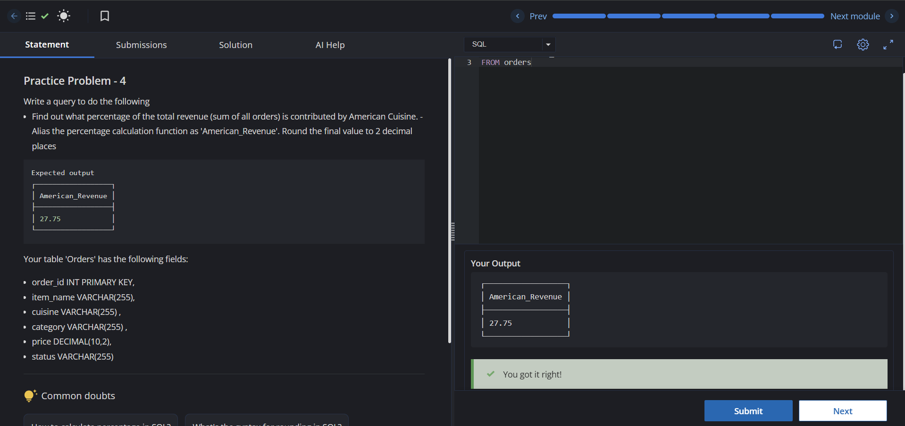
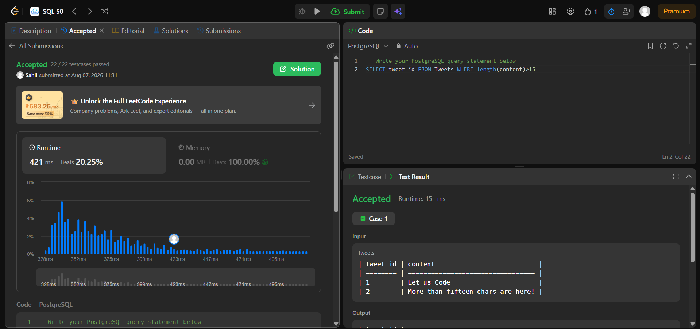
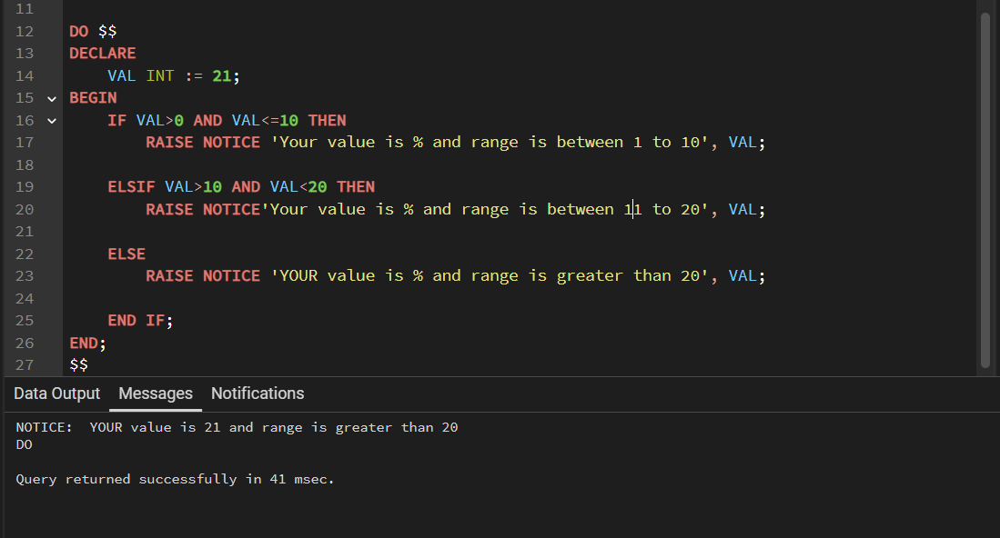

# Experiment 5 — SQL and PL/pgSQL

## 1. Aim

This experiment focuses on practical SQL and PL/pgSQL concepts through three problems:

1. Calculate the percentage of total revenue contributed by **American cuisine**.
2. Identify **invalid tweets** containing more than 15 characters.
3. Demonstrate conditional statements in **PL/pgSQL** using `IF`, `ELSIF`, and `ELSE`.

---

## 2. Tools / Technologies

- SQL
- PostgreSQL / PL/pgSQL
- CodeChef SQL Intermediate
- LeetCode SQL

---

## 3. Concepts Covered

- Aggregate functions: `SUM()`
- Conditional aggregation using `CASE`
- Percentage calculation
- `ROUND()`
- `WHERE` clause
- String function: `LENGTH()`
- PL/pgSQL variables
- `IF`, `ELSIF`, and `ELSE`
- `RAISE NOTICE`

---

# 4. Experiment 5.1 — American Cuisine Revenue

### Problem

Find what percentage of the total revenue is generated by **American cuisine**. The answer should be rounded to two decimal places.

### Query

```sql
SELECT
    ROUND(
        (100 * SUM(
            CASE
                WHEN cuisine = 'American' THEN price
                ELSE 0
            END
        )) / SUM(price),
        2
    ) AS American_Revenue
FROM orders;
```

### Explanation

The `CASE` expression selects the price only when the cuisine is American:

```sql
CASE
    WHEN cuisine = 'American' THEN price
    ELSE 0
END
```

`SUM()` calculates the American revenue, while `SUM(price)` calculates the total revenue.

The percentage is calculated as:

```text
(American Revenue / Total Revenue) × 100
```

Finally, `ROUND(..., 2)` limits the result to two decimal places.

### Output



---

# 5. Experiment 5.2 — Invalid Tweets

### Problem

A tweet is considered invalid when its content contains **more than 15 characters**. Return the `tweet_id` of every invalid tweet.

### Query

```sql
SELECT tweet_id
FROM Tweets
WHERE LENGTH(content) > 15;
```

### Explanation

`LENGTH(content)` returns the number of characters in the tweet.

The condition:

```sql
WHERE LENGTH(content) > 15
```

selects only tweets containing 16 or more characters.

A tweet containing exactly 15 characters is **not** considered invalid.

### Output



---

# 6. Experiment 5.3 — PL/pgSQL Conditional Statements

### Objective

Use a PL/pgSQL variable and conditional statements to determine which range contains the value.

### Program

```sql
DO $$
DECLARE
    VAL INT := 21;
BEGIN
    IF VAL > 0 AND VAL <= 10 THEN
        RAISE NOTICE
            'Your value is % and range is between 1 to 10',
            VAL;

    ELSIF VAL > 10 AND VAL < 20 THEN
        RAISE NOTICE
            'Your value is % and range is between 11 to 20',
            VAL;

    ELSE
        RAISE NOTICE
            'YOUR value is % and range is greater than 20',
            VAL;
    END IF;
END;
$$;
```

### Explanation

The variable is initialized as:

```sql
VAL INT := 21;
```

The program checks three conditions:

- `1–10` → first `IF` block
- `11–19` → `ELSIF` block
- `20+` → `ELSE` block

Since `VAL = 21`, the `ELSE` block is executed.

`RAISE NOTICE` displays the result in the PostgreSQL output.

### Output



---

# 7. Important Concepts

## Conditional Aggregation

Conditional aggregation allows a query to calculate a category-specific value while still keeping the complete dataset for the overall calculation.

For example:

```sql
SUM(
    CASE
        WHEN cuisine = 'American' THEN price
        ELSE 0
    END
)
```

Using:

```sql
WHERE cuisine = 'American'
```

instead would remove all other cuisines and could make the percentage calculation incorrect.

## String Functions

`LENGTH()` is useful when filtering records based on the size of text:

```sql
WHERE LENGTH(content) > 15
```

## PL/pgSQL

PL/pgSQL adds procedural programming features to PostgreSQL, including:

- Variables
- Conditions
- Loops
- Exception handling
- Procedural blocks

A `DO` block allows PL/pgSQL code to be executed without creating a permanent function.

---

# 8. Common Mistakes

### Mistake 1 — Incorrect filtering for Experiment 5.1

Avoid filtering the entire table with:

```sql
WHERE cuisine = 'American'
```

because the total revenue would then also contain only American orders.

Use conditional aggregation with `CASE` instead.

### Mistake 2 — Incorrect Invalid Tweet condition

Use:

```sql
LENGTH(content) > 15
```

not:

```sql
LENGTH(content) >= 15
```

because exactly 15 characters are allowed.

### Mistake 3 — Forgetting `END IF`

Every PL/pgSQL `IF` statement must end with:

```sql
END IF;
```

---

# 9. Learning Outcomes

After completing this experiment, the following skills were practiced:

1. Using aggregate functions with `SUM()`.
2. Performing conditional aggregation with `CASE`.
3. Calculating and rounding percentages.
4. Filtering text using `LENGTH()`.
5. Applying comparison operators correctly.
6. Declaring variables in PL/pgSQL.
7. Using `IF`, `ELSIF`, and `ELSE`.
8. Displaying procedural output using `RAISE NOTICE`.

---

# 10. Conclusion

This experiment provided practical experience with both SQL and PL/pgSQL. The first problem demonstrated conditional aggregation and percentage calculations, the second demonstrated string-based filtering, and the third introduced procedural control flow in PostgreSQL.

These techniques are useful for solving real-world database queries as well as SQL interview and competitive programming problems.

---

## Repository Contents

```text
EXP5/
├── 5.1.png
├── 5.2.png
├── 5.3.png
├── EXP5.txt
└── README.md
```

## References

- [CodeChef — SQL Intermediate](https://www.codechef.com/learn/course/sql-intermediate/SQ00BS09/problems/GSQ85D)
- [LeetCode — Invalid Tweets](https://leetcode.com/problems/invalid-tweets/)
- [PostgreSQL — PL/pgSQL Documentation](https://www.postgresql.org/docs/current/plpgsql.html)
