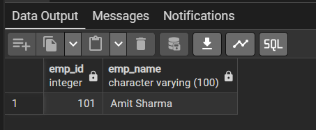
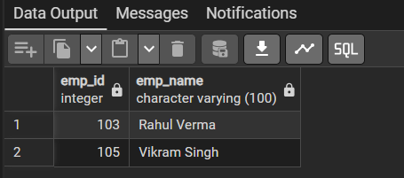

# Experiment 6 – Views and Materialized Views in PostgreSQL

## Aim

To study and implement **Views** and **Materialized Views** in PostgreSQL, including:

- Creating a normal view.
- Creating a materialized view with data.
- Creating a materialized view without data.
- Refreshing a materialized view.

---

## Software / Database Used

- **PostgreSQL**
- **pgAdmin 4** (for executing SQL queries and viewing the output)

---

## 1. Create the `employees` Table

The following table is created to store employee details:

```sql
CREATE TABLE employees (
    emp_id INT PRIMARY KEY,
    emp_name VARCHAR(100) NOT NULL,
    emp_salary DECIMAL(10, 2) NOT NULL,
    emp_city VARCHAR(100) NOT NULL
);
```

### Insert Sample Data

```sql
INSERT INTO employees (emp_id, emp_name, emp_salary, emp_city) VALUES
(101, 'Amit Sharma', 85000.00, 'Mumbai'),
(102, 'Priya Patel', 95000.00, 'Mumbai'),
(103, 'Rahul Verma', 60000.00, 'Delhi'),
(104, 'Ananya Iyer', 110000.00, 'Bangalore'),
(105, 'Vikram Singh', 55000.00, 'Delhi'),
(106, 'Sneha Reddy', 105000.00, 'Bangalore'),
(107, 'Rohan Das', 72000.00, 'Kolkata');
```

To display all employees:

```sql
SELECT * FROM employees;
```

---

# 2.1 Create and Use a View

A **View** is a virtual table based on the result of a SQL query. It does not normally store a separate copy of the underlying data.

### Create the View

```sql
CREATE VIEW emp_view AS
SELECT emp_id, emp_name
FROM employees
WHERE emp_id = 101;
```

### Display the View

```sql
SELECT * FROM emp_view;
```

### Output

The view returns the employee whose ID is `101`.



**Output:**

| emp_id | emp_name |
|---:|---|
| 101 | Amit Sharma |

---

# 2.2 Create and Use a Materialized View

A **Materialized View** stores the result of a query physically. Unlike a normal view, its stored result does not automatically reflect later changes to the underlying table. It can be refreshed when updated data is required.

## Materialized View with Data

```sql
CREATE MATERIALIZED VIEW emp_view_mv AS
SELECT emp_id, emp_name
FROM employees
WHERE emp_city = 'Delhi'
WITH DATA;
```

The `WITH DATA` clause populates the materialized view immediately when it is created.

To display its contents:

```sql
SELECT * FROM emp_view_mv;
```

### Output

The materialized view contains employees from **Delhi**.

| emp_id | emp_name |
|---:|---|
| 103 | Rahul Verma |
| 105 | Vikram Singh |

---

## Materialized View without Data

A materialized view can also be created without immediately populating it:

```sql
CREATE MATERIALIZED VIEW emp_view_mv2 AS
SELECT emp_id, emp_name
FROM employees
WHERE emp_city = 'Delhi'
WITH NO DATA;
```

`WITH NO DATA` creates the materialized view structure, but the query result is not populated yet.

The view can then be refreshed using:

```sql
REFRESH MATERIALIZED VIEW emp_view_mv2;
```

After refreshing it, the stored result can be viewed with:

```sql
SELECT * FROM emp_view_mv2;
```

### Output after Refresh



**Output:**

| emp_id | emp_name |
|---:|---|
| 103 | Rahul Verma |
| 105 | Vikram Singh |

---

# Complete SQL Script

```sql
CREATE TABLE employees (
    emp_id INT PRIMARY KEY,
    emp_name VARCHAR(100) NOT NULL,
    emp_salary DECIMAL(10, 2) NOT NULL,
    emp_city VARCHAR(100) NOT NULL
);

INSERT INTO employees (emp_id, emp_name, emp_salary, emp_city) VALUES
(101, 'Amit Sharma', 85000.00, 'Mumbai'),
(102, 'Priya Patel', 95000.00, 'Mumbai'),
(103, 'Rahul Verma', 60000.00, 'Delhi'),
(104, 'Ananya Iyer', 110000.00, 'Bangalore'),
(105, 'Vikram Singh', 55000.00, 'Delhi'),
(106, 'Sneha Reddy', 105000.00, 'Bangalore'),
(107, 'Rohan Das', 72000.00, 'Kolkata');

SELECT * FROM employees;

-- 6.1 View
CREATE VIEW emp_view AS
SELECT emp_id, emp_name
FROM employees
WHERE emp_id = 101;

SELECT * FROM emp_view;

-- 6.2 Materialized View with data
CREATE MATERIALIZED VIEW emp_view_mv AS
SELECT emp_id, emp_name
FROM employees
WHERE emp_city = 'Delhi'
WITH DATA;

SELECT * FROM emp_view_mv;

-- Materialized View without data
CREATE MATERIALIZED VIEW emp_view_mv2 AS
SELECT emp_id, emp_name
FROM employees
WHERE emp_city = 'Delhi'
WITH NO DATA;

-- Populate the materialized view
REFRESH MATERIALIZED VIEW emp_view_mv2;

SELECT * FROM emp_view_mv2;
```

---

# View vs Materialized View

| Feature | View | Materialized View |
|---|---|---|
| Stores query result | No | Yes |
| Data is physically stored | No | Yes |
| Automatically reflects base-table changes | Yes | No |
| Needs refresh | No | Yes, when updated data is required |
| Query performance | Query runs against underlying tables | Can be faster because the result is stored |
| Example | `CREATE VIEW` | `CREATE MATERIALIZED VIEW` |

---

## Result

The experiment successfully demonstrates:

1. Creation and retrieval of a **normal View**.
2. Creation of a **Materialized View with data** using `WITH DATA`.
3. Creation of a **Materialized View without data** using `WITH NO DATA`.
4. Population of a materialized view using `REFRESH MATERIALIZED VIEW`.
5. Retrieval of employee records based on filtering conditions.

---

## Repository Structure

```text
EXP6/
├── README.md
├── 6.1.png
└── 6.2.png
```

> **Note:** Keep `6.1.png` and `6.2.png` in the same folder as `README.md` when uploading to GitHub. The relative image paths in this README will then render the screenshots directly on the GitHub repository page.
