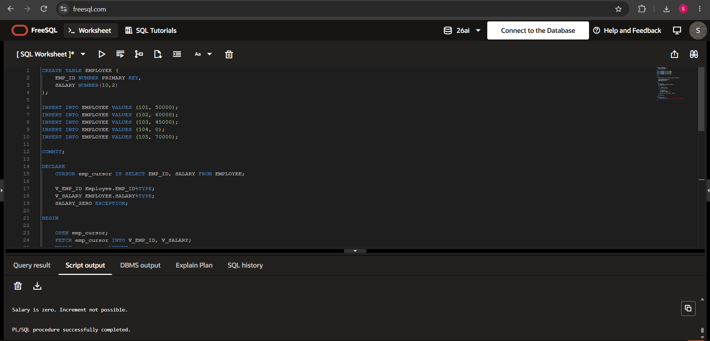

# Experiment 7 --- PL/SQL Explicit Cursor and User-Defined Exception

## 1. Aim

To write and execute a PL/SQL program using an **explicit cursor** to
process employee records, increase the salary of employees by **10%**,
and handle the condition of a zero salary using a **user-defined
exception**.

------------------------------------------------------------------------

## 2. Problem Statement

Write a PL/SQL program that:

1.  Declares an explicit cursor to retrieve `EMP_ID` and `SALARY` from
    the `EMPLOYEE` table.
2.  Opens the cursor and fetches employee records one at a time.
3.  Checks whether the salary of the current employee is zero.
4.  If the salary is zero, raises a user-defined exception named
    `SALARY_ZERO`.
5.  If the salary is not zero, increases the salary by 10%.
6.  Continues processing the employee records until there are no more
    records.
7.  Handles the `SALARY_ZERO` exception and displays an appropriate
    message.

------------------------------------------------------------------------

## 3. Software and Tools Used

-   **Oracle Database**
-   **PL/SQL**
-   **FreeSQL** --- used to execute the SQL and PL/SQL statements
-   **GitHub** --- used to store and document the experiment

------------------------------------------------------------------------

## 4. Database Table

The PL/SQL program uses a table named `EMPLOYEE`.

### Table Structure

  Column     Data Type        Description
  ---------- ---------------- ----------------------------
  `EMP_ID`   `NUMBER`         Unique employee identifier
  `SALARY`   `NUMBER(10,2)`   Salary of the employee

The table can be created using:

``` sql
CREATE TABLE EMPLOYEE (
    EMP_ID NUMBER PRIMARY KEY,
    SALARY NUMBER(10,2)
);
```

------------------------------------------------------------------------

## 5. Sample Data

The following records can be inserted into the `EMPLOYEE` table:

``` sql
INSERT INTO EMPLOYEE VALUES (101, 50000);
INSERT INTO EMPLOYEE VALUES (102, 60000);
INSERT INTO EMPLOYEE VALUES (103, 45000);
INSERT INTO EMPLOYEE VALUES (104, 0);
INSERT INTO EMPLOYEE VALUES (105, 70000);

COMMIT;
```

After insertion, the table contains:

    EMP_ID   SALARY
  -------- --------
       101    50000
       102    60000
       103    45000
       104        0
       105    70000

The employee with `EMP_ID = 104` has a salary of `0`. This record is
included specifically to demonstrate the `SALARY_ZERO` exception.

------------------------------------------------------------------------

# 6. Complete PL/SQL Program

``` sql
DECLARE
    CURSOR emp_cursor IS SELECT EMP_ID, SALARY FROM EMPLOYEE;

    V_EMP_ID Employee.EMP_ID%TYPE;
    V_SALARY EMPLOYEE.SALARY%TYPE;
    SALARY_ZERO EXCEPTION;

BEGIN

    OPEN emp_cursor;

    FETCH emp_cursor INTO V_EMP_ID, V_SALARY;

    WHILE emp_cursor%FOUND
    LOOP

        IF V_SALARY = 0 THEN
            RAISE SALARY_ZERO;
        END IF;

        UPDATE EMPLOYEE
        SET SALARY = V_SALARY * 1.10
        WHERE EMP_ID = V_EMP_ID;

        FETCH emp_cursor INTO V_EMP_ID, V_SALARY;

    END LOOP;

    CLOSE emp_cursor;

EXCEPTION
    WHEN SALARY_ZERO THEN
        DBMS_OUTPUT.PUT_LINE(
            'Salary is zero. Increment not possible.'
        );

END;
```

------------------------------------------------------------------------

# 7. Detailed Explanation

## 7.1 Declaration Section

The program begins with:

``` sql
DECLARE
```

The declaration section is used to declare cursors, variables, and
exceptions before the executable part of the PL/SQL block begins.

In this program, the following are declared:

-   One explicit cursor
-   Two variables
-   One user-defined exception

------------------------------------------------------------------------

## 7.2 Explicit Cursor

The cursor is declared as:

``` sql
CURSOR emp_cursor IS
    SELECT EMP_ID, SALARY FROM EMPLOYEE;
```

An **explicit cursor** is a programmer-controlled cursor used to process
the result of a query row by row.

The query retrieves:

-   `EMP_ID`
-   `SALARY`

from the `EMPLOYEE` table.

The cursor is named `emp_cursor`.

------------------------------------------------------------------------

## 7.3 Variables Using `%TYPE`

Two variables are declared:

``` sql
V_EMP_ID Employee.EMP_ID%TYPE;
V_SALARY EMPLOYEE.SALARY%TYPE;
```

The `%TYPE` attribute allows a variable to use the same datatype as a
particular table column.

For example:

``` sql
V_EMP_ID Employee.EMP_ID%TYPE;
```

means that `V_EMP_ID` has the same datatype as `EMP_ID`.

Similarly:

``` sql
V_SALARY EMPLOYEE.SALARY%TYPE;
```

means that `V_SALARY` has the same datatype as `SALARY`.

Using `%TYPE` avoids manually specifying the datatypes and helps keep
the variables compatible with the table columns.

------------------------------------------------------------------------

## 7.4 User-Defined Exception

The program declares:

``` sql
SALARY_ZERO EXCEPTION;
```

This creates a **user-defined exception**.

The exception represents the special condition where an employee's
salary is zero.

Unlike predefined Oracle exceptions, this exception is created and
raised explicitly by the programmer.

------------------------------------------------------------------------

# 8. Executable Section

The executable part begins with:

``` sql
BEGIN
```

All the actual processing of employee records takes place in this
section.

------------------------------------------------------------------------

## 8.1 Opening the Cursor

``` sql
OPEN emp_cursor;
```

The `OPEN` statement opens the explicit cursor.

When the cursor is opened, the query associated with it is executed and
its result becomes available for fetching.

------------------------------------------------------------------------

## 8.2 Fetching a Record

The first employee record is retrieved using:

``` sql
FETCH emp_cursor INTO V_EMP_ID, V_SALARY;
```

`FETCH` retrieves one row from the cursor and stores its values in:

``` text
V_EMP_ID
V_SALARY
```

For example, for the first record:

``` text
EMP_ID  = 101
SALARY  = 50000
```

the variables will contain:

``` text
V_EMP_ID = 101
V_SALARY = 50000
```

------------------------------------------------------------------------

# 9. Processing Records Using `%FOUND`

The program uses:

``` sql
WHILE emp_cursor%FOUND
LOOP
```

`%FOUND` is a cursor attribute.

It returns `TRUE` if the most recent `FETCH` successfully retrieved a
row.

Therefore, the loop continues while the cursor is successfully returning
employee records.

------------------------------------------------------------------------

# 10. Checking for Zero Salary

Inside the loop, the program checks:

``` sql
IF V_SALARY = 0 THEN
    RAISE SALARY_ZERO;
END IF;
```

If the current employee has a salary of zero, the condition becomes
true.

The program then executes:

``` sql
RAISE SALARY_ZERO;
```

This explicitly raises the user-defined exception.

Control immediately moves from the normal executable section to the
exception-handling section.

------------------------------------------------------------------------

# 11. Increasing Salary by 10%

For employees whose salary is not zero, the following SQL statement is
executed:

``` sql
UPDATE EMPLOYEE
SET SALARY = V_SALARY * 1.10
WHERE EMP_ID = V_EMP_ID;
```

The salary is multiplied by `1.10`, which represents a 10% increase.

### Example

If an employee has:

``` text
SALARY = 50000
```

then:

``` text
New Salary = 50000 × 1.10
           = 55000
```

Therefore, the employee's salary becomes `55000`.

Another example:

``` text
SALARY = 60000

60000 × 1.10 = 66000
```

So the new salary becomes `66000`.

------------------------------------------------------------------------

# 12. Fetching the Next Record

After processing an employee, the program fetches the next record:

``` sql
FETCH emp_cursor INTO V_EMP_ID, V_SALARY;
```

This moves the cursor to the next employee.

The process continues until the cursor has no more records.

------------------------------------------------------------------------

# 13. Closing the Cursor

After all available records have been processed, the cursor is closed:

``` sql
CLOSE emp_cursor;
```

Closing the cursor releases the resources associated with it.

------------------------------------------------------------------------

# 14. Exception Handling

The exception-handling section starts with:

``` sql
EXCEPTION
```

The program handles the user-defined exception using:

``` sql
WHEN SALARY_ZERO THEN
```

When `SALARY_ZERO` is raised, the following statement is executed:

``` sql
DBMS_OUTPUT.PUT_LINE(
    'Salary is zero. Increment not possible.'
);
```

This displays the message:

``` text
Salary is zero. Increment not possible.
```

------------------------------------------------------------------------

# 15. Step-by-Step Execution

Consider the following sample data:

    EMP_ID   SALARY
  -------- --------
       101    50000
       102    60000
       103    45000
       104        0
       105    70000

The cursor starts processing the records one by one.

### Step 1 --- Employee 101

``` text
EMP_ID = 101
SALARY = 50000
```

Salary is not zero.

The salary is increased by 10%:

``` text
50000 × 1.10 = 55000
```

The salary is updated to `55000`.

------------------------------------------------------------------------

### Step 2 --- Employee 102

``` text
EMP_ID = 102
SALARY = 60000
```

Salary is not zero.

``` text
60000 × 1.10 = 66000
```

The salary is updated to `66000`.

------------------------------------------------------------------------

### Step 3 --- Employee 103

``` text
EMP_ID = 103
SALARY = 45000
```

Salary is not zero.

``` text
45000 × 1.10 = 49500
```

The salary is updated to `49500`.

------------------------------------------------------------------------

### Step 4 --- Employee 104

``` text
EMP_ID = 104
SALARY = 0
```

The program checks:

``` sql
IF V_SALARY = 0 THEN
```

The condition is true.

Therefore:

``` sql
RAISE SALARY_ZERO;
```

is executed.

The program moves to the exception handler and displays:

``` text
Salary is zero. Increment not possible.
```

The normal loop does not continue after this exception is raised.

------------------------------------------------------------------------

# 16. Exception Flow

The exception handling can be represented as:

``` text
Employee salary
       |
       v
Is salary equal to 0?
       |
   +---+---+
   |       |
  YES      NO
   |       |
   v       v
RAISE    Increase
Exception salary by 10%
   |
   v
EXCEPTION
Handler
   |
   v
Display message
```

------------------------------------------------------------------------

# 17. Output

The program was executed successfully in **FreeSQL**.

When the cursor encounters the employee whose salary is `0`, the
user-defined exception `SALARY_ZERO` is raised.

The following message is displayed:

``` text
Salary is zero. Increment not possible.
```

The output also shows:

``` text
PL/SQL procedure successfully completed.
```

This indicates that the exception was successfully handled by the
`EXCEPTION` block.

The output message is produced using:

``` sql
DBMS_OUTPUT.PUT_LINE(
    'Salary is zero. Increment not possible.'
);
```

------------------------------------------------------------------------

# 18. Execution Screenshot

The following screenshot shows the PL/SQL program being executed in
FreeSQL along with the output produced by the program.



------------------------------------------------------------------------

# 19. Expected Salary Updates

Before execution, the sample data is:

    EMP_ID   Original Salary Result
  -------- ----------------- -----------------------------
       101             50000 Updated to 55000
       102             60000 Updated to 66000
       103             45000 Updated to 49500
       104                 0 Exception raised
       105             70000 Not reached after exception

The first three employees are processed successfully.

When employee `104` is encountered, the `SALARY_ZERO` exception is
raised. Therefore, the program exits the normal processing flow at that
point.

As a result, employee `105` is not processed by this particular
implementation.

------------------------------------------------------------------------

# 20. Important PL/SQL Concepts Used

  Concept                  Purpose
  ------------------------ ------------------------------------------------
  `DECLARE`                Starts the declaration section
  `CURSOR`                 Declares an explicit cursor
  `OPEN`                   Opens the cursor
  `FETCH`                  Retrieves a row from the cursor
  `%FOUND`                 Checks whether the last fetch returned a row
  `%TYPE`                  Uses the datatype of an existing table column
  `WHILE LOOP`             Repeats processing while the condition is true
  `IF`                     Performs conditional checking
  `RAISE`                  Explicitly raises an exception
  `EXCEPTION`              Starts the exception-handling section
  `WHEN`                   Specifies the exception to handle
  `UPDATE`                 Modifies the salary stored in the table
  `CLOSE`                  Closes the cursor
  `DBMS_OUTPUT.PUT_LINE`   Displays a message in the output

------------------------------------------------------------------------

# 21. Explicit Cursor Lifecycle

An explicit cursor generally follows this lifecycle:

``` text
DECLARE
   |
   v
OPEN
   |
   v
FETCH
   |
   v
PROCESS
   |
   v
FETCH NEXT ROW
   |
   v
PROCESS
   |
   v
CLOSE
```

In this experiment, the cursor is explicitly:

1.  Declared
2.  Opened
3.  Fetched
4.  Used to process employee records
5.  Closed

------------------------------------------------------------------------

# 22. Implicit Cursor vs Explicit Cursor

  -----------------------------------------------------------------------
  Implicit Cursor                     Explicit Cursor
  ----------------------------------- -----------------------------------
  Created automatically by Oracle     Declared by the programmer

  Suitable for simple SQL operations  Suitable for controlled row-by-row
                                      processing

  Programmer does not explicitly open Programmer explicitly opens it
  it                                  

  Programmer does not explicitly      Programmer explicitly fetches
  fetch from it                       records

  Programmer does not explicitly      Programmer explicitly closes it
  close it                            

  Less control                        More control
  -----------------------------------------------------------------------

This experiment demonstrates an **explicit cursor** because the
programmer explicitly controls the cursor using `OPEN`, `FETCH`, and
`CLOSE`.

------------------------------------------------------------------------

# 23. Why Use a User-Defined Exception?

A user-defined exception is useful when the programmer wants to identify
and handle a specific application condition.

In this experiment:

``` text
Salary = 0
```

is treated as a special condition.

Instead of allowing the program to continue with the normal
salary-increment operation, the program explicitly raises:

``` sql
SALARY_ZERO
```

This makes the program's error-handling logic clear and easy to
understand.

------------------------------------------------------------------------

# 24. Advantages of Explicit Cursors

Explicit cursors are useful when:

-   Multiple records need to be processed individually.
-   Different logic needs to be applied to each row.
-   Conditions need to be checked for individual records.
-   The programmer needs control over the fetching process.
-   Row-by-row processing is required.

In this experiment, the salary of every employee is checked individually
before the update is performed.

------------------------------------------------------------------------

# 25. Key Takeaways

-   PL/SQL combines SQL with procedural programming features.
-   An explicit cursor allows query results to be processed one row at a
    time.
-   `OPEN` opens an explicit cursor.
-   `FETCH` retrieves records from the cursor.
-   `%FOUND` checks whether the most recent fetch successfully retrieved
    a row.
-   `%TYPE` allows variables to use the datatype of table columns.
-   A `WHILE` loop can be used to process cursor records.
-   `IF` is used to check whether the salary is zero.
-   `RAISE` explicitly triggers a user-defined exception.
-   The `EXCEPTION` section handles exceptional conditions.
-   `UPDATE` is used to increase the salary by 10%.
-   `DBMS_OUTPUT.PUT_LINE` displays messages during PL/SQL execution.
-   The zero-salary employee demonstrates how a user-defined exception
    interrupts normal processing.

------------------------------------------------------------------------

# 26. Result

The PL/SQL program was **successfully executed** using an explicit
cursor and a user-defined exception.

The program successfully:

-   Retrieved employee records using an explicit cursor.
-   Processed the records one at a time.
-   Increased non-zero employee salaries by 10%.
-   Detected the zero-salary condition.
-   Raised the `SALARY_ZERO` exception.
-   Handled the exception using the `EXCEPTION` block.
-   Displayed the message:

``` text
Salary is zero. Increment not possible.
```

Hence, the experiment successfully demonstrates **explicit cursor
handling, row-by-row processing, salary updates, and user-defined
exception handling in PL/SQL**.

------------------------------------------------------------------------

# 27. Files Included

The experiment folder contains:

``` text
EXP7/
│
├── README.md
├── Exp7.txt
└── 7.1.png
```

### `README.md`

Contains the complete documentation, explanation, source code, execution
details, output, and conclusion.

### `Exp7.txt`

Contains the PL/SQL source code used for the experiment.

### `7.1.png`

Contains the screenshot of the PL/SQL program and its output in FreeSQL.

------------------------------------------------------------------------

## Experiment Status

**Status: Successfully Completed**

**Topic:** Explicit Cursor and User-Defined Exception in PL/SQL

**Environment:** FreeSQL / Oracle PL/SQL
