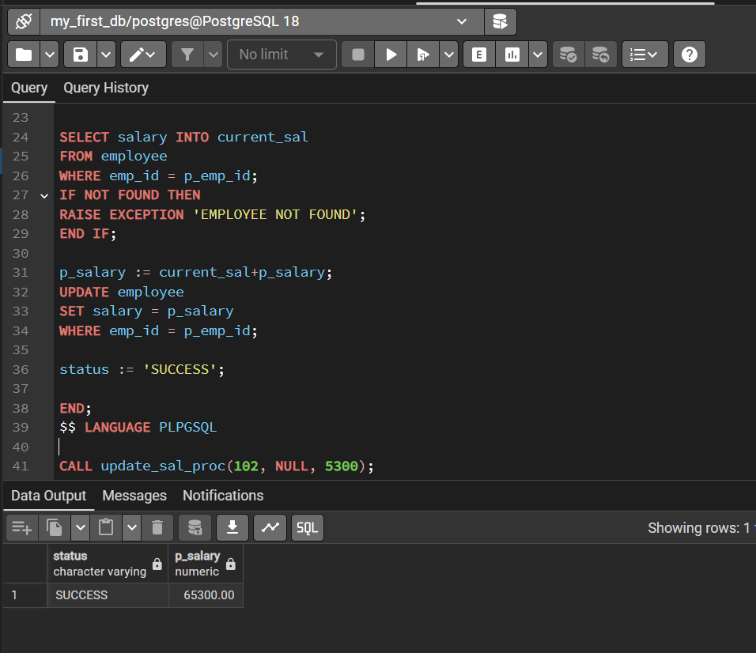

# EXP8 — PostgreSQL Stored Procedure for Salary Update

## 📌 Experiment Overview

This experiment demonstrates how to create and execute a **PostgreSQL stored procedure** using PL/pgSQL.

The procedure, `update_sal_proc`, is designed to:

- Accept an employee ID.
- Accept a salary amount to be added to the employee's current salary.
- Check whether the employee exists.
- Raise an exception if the employee does not exist.
- Update the employee's salary when the employee exists.
- Return the updated salary through an `INOUT` parameter.
- Return a success message through an `OUT` parameter.

---

## 📂 Files in this Experiment

```text
EXP8/
│
├── Exp8.txt       # PostgreSQL stored procedure and CALL statement
├── Exp8.png       # Screenshot showing successful execution
└── README.md      # Documentation for the experiment
```

> **Note:** Keep `Exp8.png` in the same `EXP8` folder as this `README.md`. The screenshot below is referenced using a relative path so that it will be displayed automatically on GitHub.

---

## 🗃️ Database Requirement

The procedure operates on an existing table named `employee`.

The procedure expects the table to contain at least these columns:

| Column | Purpose |
|---|---|
| `emp_id` | Identifies the employee |
| `salary` | Stores the employee's current salary |

A suitable table structure would be conceptually:

```sql
CREATE TABLE employee (
    emp_id INT PRIMARY KEY,
    salary NUMERIC(20, 2)
);
```

The `employee` table itself is not included in the provided experiment file, so the above is only the required structure for the procedure to work.

---

# 🛠️ Stored Procedure

The procedure is named:

```text
update_sal_proc
```

It has three parameters:

| Parameter | Mode | Data Type | Purpose |
|---|---|---|---|
| `p_emp_id` | `IN` | `INT` | Employee ID whose salary needs to be updated |
| `status` | `OUT` | `VARCHAR(20)` | Returns the status message |
| `p_salary` | `INOUT` | `NUMERIC(20,2)` | Receives the amount to add and returns the updated salary |

### Procedure Code

```sql
CREATE OR REPLACE PROCEDURE update_sal_proc(
    IN p_emp_id INT,
    OUT status VARCHAR(20),
    INOUT p_salary NUMERIC(20, 2)
)
AS $$
DECLARE
    current_sal NUMERIC;
BEGIN

    SELECT salary INTO current_sal
    FROM employee
    WHERE emp_id = p_emp_id;

    IF NOT FOUND THEN
        RAISE EXCEPTION 'EMPLOYEE NOT FOUND';
    END IF;

    p_salary := current_sal + p_salary;

    UPDATE employee
    SET salary = p_salary
    WHERE emp_id = p_emp_id;

    status := 'SUCCESS';

END;
$$ LANGUAGE PLPGSQL;
```

---

# 🔍 Explanation of the Procedure

## 1. `IN` Parameter — `p_emp_id`

```sql
IN p_emp_id INT
```

This parameter receives the ID of the employee whose salary is going to be updated.

For example:

```text
p_emp_id = 102
```

means that the procedure will look for employee `102`.

---

## 2. `OUT` Parameter — `status`

```sql
OUT status VARCHAR(20)
```

This parameter is used to return the result/status of the procedure.

For a successful update:

```sql
status := 'SUCCESS';
```

If the employee does not exist, the procedure raises:

```sql
RAISE EXCEPTION 'EMPLOYEE NOT FOUND';
```

---

## 3. `INOUT` Parameter — `p_salary`

```sql
INOUT p_salary NUMERIC(20, 2)
```

This parameter has two purposes.

### Input

The caller provides the amount that should be added to the employee's current salary.

For example:

```text
5300
```

### Output

After the calculation, the same parameter contains the employee's updated salary.

The calculation is:

```sql
p_salary := current_sal + p_salary;
```

For example, if:

```text
Current salary = 60000
Amount to add  = 5300
```

then:

```text
Updated salary = 60000 + 5300
               = 65300
```

---

# 🔎 Checking Whether the Employee Exists

The procedure first retrieves the employee's current salary:

```sql
SELECT salary INTO current_sal
FROM employee
WHERE emp_id = p_emp_id;
```

The result is stored in:

```text
current_sal
```

The procedure then checks:

```sql
IF NOT FOUND THEN
    RAISE EXCEPTION 'EMPLOYEE NOT FOUND';
END IF;
```

`FOUND` is a PL/pgSQL status variable that indicates whether the preceding SQL statement found a row.

Therefore:

- If the employee exists → continue with the salary update.
- If the employee does not exist → raise an exception.

---

# 💰 Updating the Salary

After retrieving the current salary:

```sql
p_salary := current_sal + p_salary;
```

The procedure updates the employee record:

```sql
UPDATE employee
SET salary = p_salary
WHERE emp_id = p_emp_id;
```

Finally, the procedure sets:

```sql
status := 'SUCCESS';
```

---

# ▶️ Executing the Procedure

The provided experiment executes the procedure using:

```sql
CALL update_sal_proc(102, NULL, 5300);
```

Here:

```text
p_emp_id = 102
status   = NULL
p_salary = 5300
```

Because `status` is an `OUT` parameter, `NULL` is supplied for that position in the `CALL`.

After execution, `p_salary` contains the updated salary and `status` contains the result.

---

# 📸 Execution Output

The following screenshot shows the successful execution of the procedure.



### Output shown in the screenshot

| status | p_salary |
|---|---:|
| SUCCESS | 65300.00 |

This indicates that the procedure executed successfully and returned:

```text
status   = SUCCESS
p_salary = 65300.00
```

---

# 🧠 Key PL/pgSQL Concepts Demonstrated

### Stored Procedure

A stored procedure is a database-side program that can contain SQL statements and procedural logic.

### `IN` Parameter

Used to pass a value **into** the procedure.

```sql
IN p_emp_id INT
```

### `OUT` Parameter

Used to return a value **from** the procedure.

```sql
OUT status VARCHAR(20)
```

### `INOUT` Parameter

Can receive an input value and return a modified value.

```sql
INOUT p_salary NUMERIC(20, 2)
```

### `SELECT ... INTO`

Used to store a query result in a PL/pgSQL variable:

```sql
SELECT salary INTO current_sal
FROM employee
WHERE emp_id = p_emp_id;
```

### `FOUND`

Used to determine whether the preceding SQL statement affected/found a row.

```sql
IF NOT FOUND THEN
```

### `RAISE EXCEPTION`

Used to generate an error when the employee cannot be found:

```sql
RAISE EXCEPTION 'EMPLOYEE NOT FOUND';
```

### Variable Assignment

PL/pgSQL uses `:=` for variable assignment:

```sql
p_salary := current_sal + p_salary;
status := 'SUCCESS';
```

---

# 🔄 Execution Flow

```text
             CALL update_sal_proc
                      │
                      ▼
              Receive employee ID
                      │
                      ▼
          Search employee table
                      │
             ┌────────┴────────┐
             │                 │
          Found             Not Found
             │                 │
             ▼                 ▼
      Get current salary   Raise Exception
             │
             ▼
     Add input salary amount
             │
             ▼
       Update employee
             │
             ▼
       status = SUCCESS
             │
             ▼
      Return OUT/INOUT values
```

---

# 📋 Complete SQL

```sql
CREATE OR REPLACE PROCEDURE update_sal_proc(
    IN p_emp_id INT,
    OUT status VARCHAR(20),
    INOUT p_salary NUMERIC(20, 2)
)
AS $$
DECLARE
    current_sal NUMERIC;
BEGIN

    SELECT salary INTO current_sal
    FROM employee
    WHERE emp_id = p_emp_id;

    IF NOT FOUND THEN
        RAISE EXCEPTION 'EMPLOYEE NOT FOUND';
    END IF;

    p_salary := current_sal + p_salary;

    UPDATE employee
    SET salary = p_salary
    WHERE emp_id = p_emp_id;

    status := 'SUCCESS';

END;
$$ LANGUAGE PLPGSQL;

CALL update_sal_proc(102, NULL, 5300);
```

---

## ✅ Result

The procedure successfully updates the salary of the specified employee by adding the supplied salary amount.

The execution shown in the screenshot returns:

```text
SUCCESS | 65300.00
```

---

## 📝 Conclusion

This experiment demonstrates the use of a PostgreSQL stored procedure with `IN`, `OUT`, and `INOUT` parameters. It also demonstrates retrieving data using `SELECT ... INTO`, checking whether a query found a row using `FOUND`, handling an invalid employee ID with `RAISE EXCEPTION`, updating a table, and returning values from a procedure.
