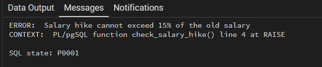
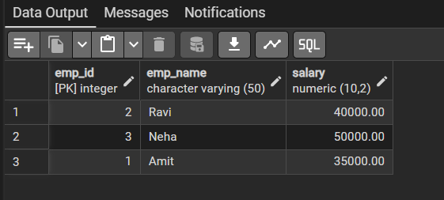

# Experiment 9 — Salary Validation and Transaction Control

This experiment demonstrates two PostgreSQL database features:

1. A row-level trigger that enforces a maximum 15% salary increase when a salary is updated.
2. Explicit transaction control using `BEGIN`, `SAVEPOINT`, `ROLLBACK TO SAVEPOINT`, and `COMMIT`.

The SQL source and screenshots are included in this folder. The examples are intended to be run in PostgreSQL, for example from pgAdmin's Query Tool.

## Folder contents

| File | Description |
| --- | --- |
| `Exp9.txt` | SQL statements for exercises 9.1 and 9.2. |
| `9.1.png` | PostgreSQL error output from an update that exceeds the 15% hike limit. |
| `9.2.png` | Employee table output after the savepoint rollback and commit. |
| `README.md` | Experiment overview, setup guidance, execution steps, and expected behavior. |

## Requirements and assumptions

- PostgreSQL with PL/pgSQL enabled (PL/pgSQL is installed by default in standard PostgreSQL databases).
- A database in which you can create a function and trigger.
- The source script assumes the tables and sample employee rows already exist. The setup below is an example only; use your course's required schema if it differs.
- Run the two sections independently. Section 9.1 refers to `Salary_Hike`; section 9.2 refers to `tran_employees`.

### Optional example setup

Use this setup only in a practice database where these table names are available. It provides sample starting data compatible with the final result shown in `9.2.png` and makes the 9.1 update to 44,000 remain within a 15% increase.

```sql
CREATE TABLE Salary_Hike (
    emp_id integer PRIMARY KEY,
    emp_name varchar(50),
    salary numeric(10, 2)
);

INSERT INTO Salary_Hike (emp_id, emp_name, salary)
VALUES (1, 'Amit', 40000);

CREATE TABLE tran_employees (
    emp_id integer PRIMARY KEY,
    emp_name varchar(50),
    salary numeric(10, 2)
);

INSERT INTO tran_employees (emp_id, emp_name, salary)
VALUES
    (1, 'Amit', 30000),
    (2, 'Ravi', 40000),
    (3, 'Neha', 50000);
```

If you rerun this setup, clear or recreate the example tables first to avoid duplicate-key errors. The trigger function and trigger in section 9.1 use the table and column names exactly as written, including the table name `Salary_Hike`.

## Exercise 9.1 — Reject salary hikes greater than 15%

### How the trigger works

`check_salary_hike()` is a PL/pgSQL trigger function. PostgreSQL calls it for each row before an update of the `salary` column in `Salary_Hike`:

- `OLD.salary` is the value currently stored in the row.
- `NEW.salary` is the value proposed by the update.
- The condition `NEW.salary > OLD.salary * 1.15` detects an increase above 15%.
- `RAISE EXCEPTION` reports the violation and cancels the statement. Since this is a `BEFORE` trigger, the excessive value is not written to the row.
- When the condition is false, returning `NEW` allows the update to proceed.

The `15%%` in the message is intentional for a `RAISE` format string: `%%` emits a literal percent sign in the resulting message.

### Run and observe

1. Create or select the `Salary_Hike` table and ensure employee 1 has a salary. With the optional setup above, the starting salary is 40,000.
2. Run the function and trigger definitions in `Exp9.txt` under `#9.1`.
3. Run the first update, which sets employee 1's salary to 44,000. Against a 40,000 starting salary, this is a 10% increase and should succeed.
4. Run the second update, which attempts to set the salary to 90,000. This is above the permitted 46,000 maximum from a 40,000 starting salary, so PostgreSQL should display the exception.

The screenshot captures the expected exception. In pgAdmin, an error in the second update does not undo the already completed first update when the statements are submitted separately in autocommit mode. If both statements are run as one explicit transaction, the error can leave that transaction aborted until it is rolled back.



### Expected rule

For a starting salary of 40,000:

| Proposed salary | Increase | Expected result |
| ---: | ---: | --- |
| 44,000 | 10% | Accepted |
| 46,000 | 15% | Accepted; the condition rejects values greater than 15%, not equal to 15%. |
| 46,001 | More than 15% | Rejected |
| 90,000 | 125% | Rejected |

The rule checks only updates to the `salary` column. It does not validate the initial salary inserted into the table, and it does not impose a general lower bound such as salary being nonnegative.

## Exercise 9.2 — Transaction and savepoint

### Statement sequence

The block in `Exp9.txt` performs these operations in order:

1. `BEGIN` starts a transaction.
2. The first `UPDATE` adds 5,000 to employee 1's salary.
3. `SAVEPOINT salary_update` marks the point to which a partial rollback can return.
4. The next `UPDATE` assigns -20,000 to employee 2. The provided SQL has no constraint or trigger that rejects this value; it is a deliberately temporary change for demonstrating rollback.
5. `ROLLBACK TO SAVEPOINT salary_update` undoes work performed after the savepoint. Employee 2's attempted salary change is therefore discarded, while employee 1's earlier increase remains part of the transaction.
6. `COMMIT` makes the retained change permanent.
7. The final `SELECT` displays the committed table values.

With the optional example starting data, employee 1 changes from 30,000 to 35,000; employee 2 remains at 40,000; and employee 3 remains at 50,000. These are the values shown in the screenshot.



### Important distinction

The negative salary is not rejected by a database rule in this script. The demonstration explicitly rolls that update back. To prevent negative salaries in real data, add a separate constraint such as `CHECK (salary >= 0)` or implement an appropriate validation trigger.

## Running in pgAdmin

1. Connect pgAdmin to the intended PostgreSQL server and select the target database.
2. Open **Tools → Query Tool** (or open the Query Tool for the database from the browser tree).
3. If needed, run the optional setup SQL above once. Confirm the tables and rows with `SELECT * FROM Salary_Hike;` and `SELECT * FROM tran_employees;`.
4. Copy and run section `#9.1` from `Exp9.txt` first. The function and trigger definitions should be created before the sample `UPDATE` statements.
5. Run the 9.1 updates individually if you want to inspect the successful and failing outcomes separately. The excessive update is expected to report an exception.
6. Run section `#9.2` as a complete transaction block, including `BEGIN` through `COMMIT`.
7. Review the final result grid, or run `SELECT * FROM tran_employees;` again to verify the committed values.

## Troubleshooting

- **`relation "salary_hike" does not exist`** — Create the table in the selected database, or change the trigger's target table to match your actual table name. PostgreSQL folds unquoted identifiers to lowercase; `Salary_Hike` without quotes resolves to `salary_hike`.
- **`column "salary" does not exist`** — Check that the table has a `salary` column and that the SQL is being run against the intended schema.
- **`function check_salary_hike() does not exist`** — Run the `CREATE OR REPLACE FUNCTION` block before creating the trigger. The function must return `TRIGGER` and use PL/pgSQL.
- **The 44,000 update is rejected** — The actual old salary may be below the assumed 40,000. The allowed maximum is the current salary multiplied by 1.15; inspect the row before testing.
- **The error says the transaction is aborted** — Roll back the failed transaction before issuing more statements. In pgAdmin, a failing statement inside an explicit transaction requires `ROLLBACK` (or rollback to an applicable savepoint) before that transaction can continue.
- **The final 9.2 values differ** — The result depends on the starting rows and whether the transaction block was run more than once. Reset the sample rows before repeating the demonstration.

## Learning outcomes

After completing this experiment, you should be able to define a PL/pgSQL trigger function, compare old and proposed row values, stop an invalid update with an exception, and use a savepoint to undo only part of a transaction while preserving earlier work.
